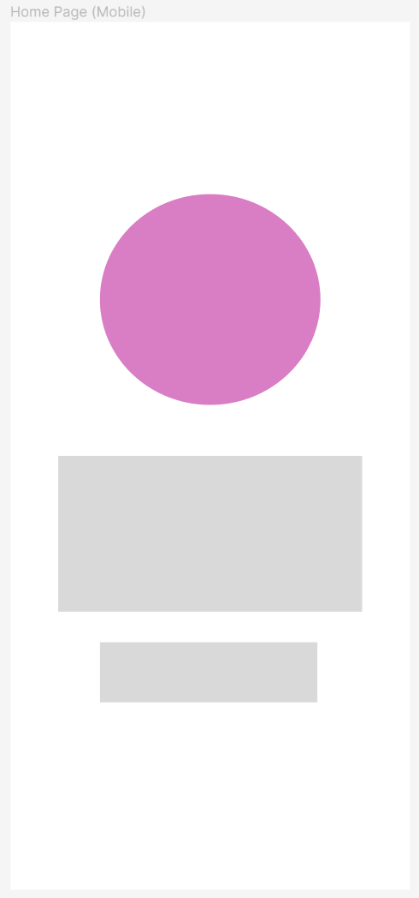

# **Feb24 Term 1 Assignment 2 Web Portfolio**

## **Shahrul's Web Portfolio**

I have designed my website to act as a platform to showcase my coding and development skills.   and future projects to potetnial employers. You can view my website [here](https://shahrulwd.netlify.app/)

## **All links**

- [Portfolio Website](https://shahrulwd.netlify.app/)
- [Github Repository](https://github.com/Shalulu94/Feb24-t1a2-portfolio/tree/main)
- [LinkedIn](https://www.linkedin.com/in/shahrul-nasir-a7308b122/)

## **Features and Functionality**

My website is designed to be simple and minimalistic, displaying all the relevant information without being cluttered or excessive.

### Key features include:

- Multiple linked pages with constantly present navigation bar to allow users to switch between each page from any page
    - **Home Page** - Landing page with a very simple design featuring website logo and a brief description of the page
    - **About me** - Provide some insight into my life including my background, hobbies and previous work experience. This page includes a mini nav bar to switch between the sub topics
    - **Projects** - This is a showcase of all the projects I have worked on across different platforms and programming languages. This page will also include links to relevant project pages
    - **Blogs** - This is to keep updated with things about my life, both personal and professional. Provides potential employers with a better understanding of my personality and work ethic
    - **Connect** - Contains links to my professional profiles including LinkedIn and Github. Also allows users to contact me directly via email
- Each page has been designed with responsiveness in mind. Elements will change depending on whether user is viewing this one a computer screen or a mobile. Given the simple design nature, a third break point for tablets was not necessary as structures are reasonable above 700px
- The Tech stack required for the development include:
    - **Diagrams** - Utilised for the sitemap. Designed online at this [Website](https://app.diagrams.net/)
    - **Figma** - For Wireframing and design planning
    - **Windows Terminal** - For version control and connection to Github repo
    - **Visual Studios Code** - Primary IDE for coding
    - **HTML** - Page content
    - **CSS** - Page styling including animations
    - **GitHub** - Version control
    - **Netlify** - Deployment

## Sitemap

Please see below my Sitemap. Each page is interlinked with each other allowing user to navigate between every page from any page. Only exception is the Homepage which is used more as a landing page before users enter into main content. 

The creation of the sitemap was the first step of my website development. It allowed me to visualise the amount of pages necessary, how I wanted to split the information across different pages and the navigation links required. Given the idea is that each main page would have it's own theme, it also gave me an indication of how many page templates i needed to create during the wireframing process.

## Wireframing - Figma

The second step in my development process was wireframing and designing all of the necessary page themes. I would consider my wireframes to be low fidelity, however in order to make it easier for me to visualise how certain elements change depending on desktop/mobile view, I've utilised colours for the specific elements.

### Homepage

The homepage was a simple landing page and was intended to not include a lot of overwhelming features or information. Originally this was designed to include a photo of myself on the homepage with a brief description. During the actual design process, I experimented using my self-made website logo which i thought better suited as a landing page. 

**Final product**

